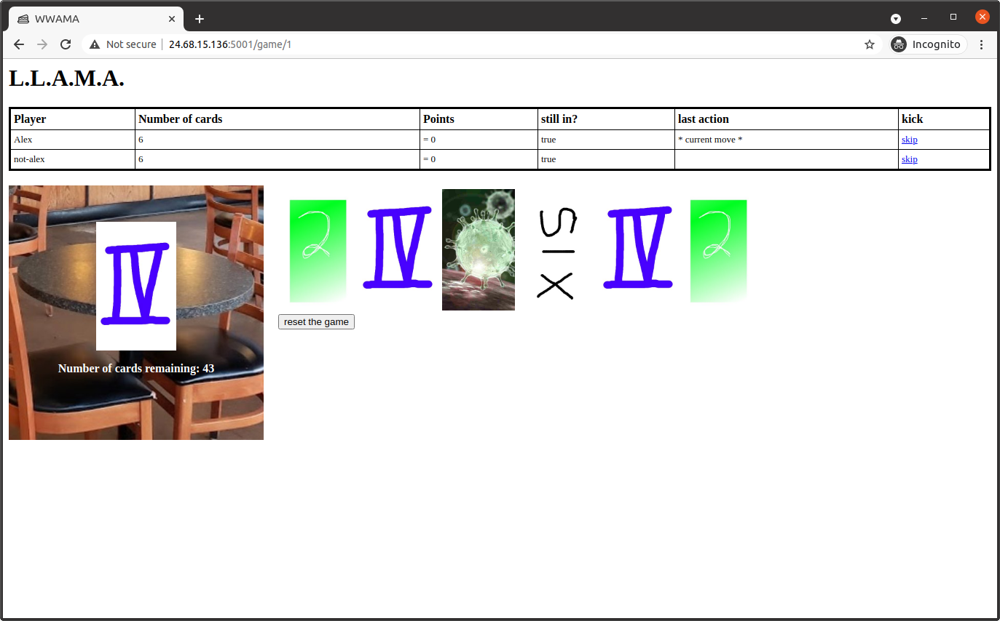

# LLAMA
L.L.A.M.A.

## Building and Running code from this repo

step 1: install [earthly](https://earthly.dev/get-earthly)

step 2: build and launch the LLAMA container with:

    earthly +run

Then you should be able to access the game at [http://127.0.0.1:5001](http://127.0.0.1:5001)

## Running the "official" docker container

The docker image built by the earthfile is also pushed to https://hub.docker.com/r/alexcb132/llama and can be run with:

    docker run --rm --network=host alexcb132/llama:latest

# FAQ

## How do you change the IP it binds to?

Open a PR and fix the code under `get_host()`.

### What if I don't know how to code?

Ask Fiona to help you.
